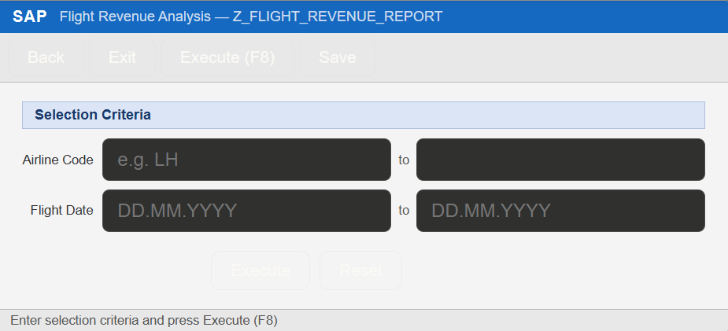
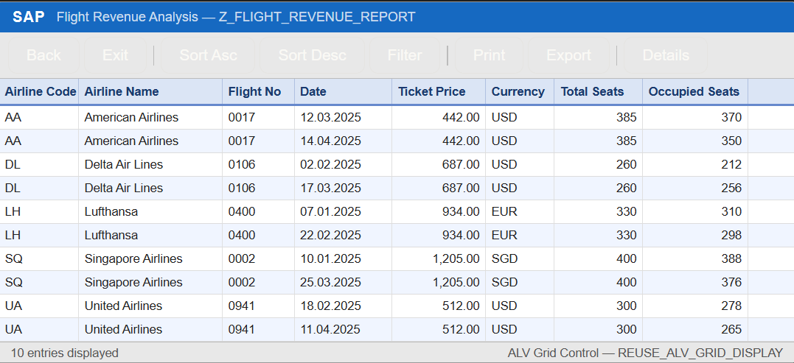

# SAP ABAP ALV Report — Flight Revenue Analysis

## Overview

An ABAP report that fetches and displays flight revenue data by joining the **SFLIGHT** and **SCARR** tables using an INNER JOIN. Results are displayed in an interactive ALV Grid with sorting and filtering support.

## Features

- Selection screen filtering by Airline Code and Flight Date range
- INNER JOIN across SFLIGHT (flight data) + SCARR (airline details)
- Sorted output by airline and date
- ALV Grid display with reusable field catalog helper
- Clean modular code using FORM routines

## SAP Tables Used

| Table   | Description              |
|---------|--------------------------|
| SFLIGHT | Flight details (price, seats, date) |
| SCARR   | Airline carrier names    |

## Output Columns

| Column         | Description         |
|----------------|---------------------|
| Airline Code   | Carrier ID          |
| Airline Name   | Full carrier name   |
| Flight No      | Connection ID       |
| Date           | Flight date         |
| Ticket Price   | Price per seat      |
| Currency       | Currency code       |
| Total Seats    | Max seat capacity   |
| Occupied Seats | Booked seat count   |

## How to Run

1. Open transaction **SE38** in SAP GUI
2. Enter program name: `Z_FLIGHT_REVENUE_REPORT`
3. Click **Create** → choose type: *Executable Program*
4. Paste the code from `Z_FLIGHT_REVENUE_REPORT.abap`
5. **Save** and **Activate** (Ctrl+F3)
6. **Execute** (F8)
7. Enter filter values on the selection screen (leave blank for all records)
8. View results in the ALV Grid

## Screenshots

### Selection Screen

### Output Screen

## Author

[Your Name]
